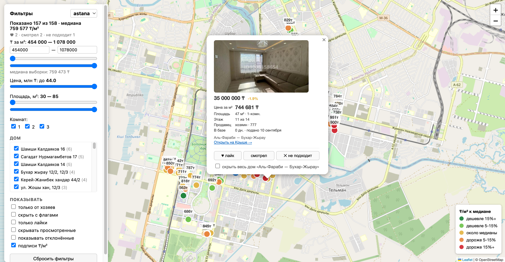

# Shanyrak

Apartment hunting on krisha.kz, on one map: every listing you care about as a
dot coloured by how its price per square metre compares to the median of your
search, with price history, delisting detection and marks that survive.

Named after the *shanyrak* — the crown at the top of a yurt, and the highest
point above the roof.



A Python scraper collects listings into SQLite; a Go server turns them into the
map, a JSON API and a Telegram digest.

## Why it exists

Krisha shows you a list. What it does not show is whether a flat is cheap *for
its area*: you cannot see that this 500 000 ₸/m² is 18% under the median of the
five blocks you would actually live in, that it was 3 million more expensive
three weeks ago, or that you already dismissed it last Saturday.

Shanyrak answers those three questions and keeps the answers between runs.

## What it does

- **Draws the market.** Every listing is a dot; green is cheaper than the
  median of your search, red is dearer. The median is per search, because
  comparing Astana to Almaty produces a number that means nothing.
- **Remembers prices.** Each crawl compares against the database, so a listing
  carries its own price history and shows "▼ 3 000 000 ₸ since you first saw it".
- **Notices disappearances.** Listings that stop appearing in a complete crawl
  are flagged as delisted instead of being deleted.
- **Keeps your marks.** Liked, seen and rejected are stored server-side in
  SQLite, so they survive a browser change, and rejected listings are skipped by
  the next crawl entirely.
- **Filters on the map.** Price per m², total price, area, rooms, owners only,
  flagged wording, and hiding an entire building you have already ruled out.
- **Sends a digest.** Optional Telegram message when something appears below
  your threshold or drops in price.

## How it gets the data

Krisha serves listing pages (`/a/show/{id}`) behind a bot-protection challenge:
a plain HTTP client gets HTTP 468 and a JavaScript challenge page, never the
listing. Shanyrak does not try to defeat that.

Instead it reads the JSON feed behind the site's own public map tab, which
answers without any challenge:

```
GET /a/ajax-map-list/map/<section>/?<filters>&areas=p<polygon>&page=N
```

Each response carries twenty listings as structured JSON — price, title, area,
rooms, address, seller type, photos and **exact coordinates** — plus the
rendered cards, which is where the posting dates come from.

This is both simpler and lighter than parsing search pages and then opening
every listing: one request per twenty listings instead of one per listing, with
no HTML selectors to break when the markup changes.

**What the feed does not carry:** flat condition, renovation state, ceiling
height, bathroom and balcony details, the full description, and the year the
building was built. Those only ever existed on the listing page.

## Quick start

Requires Docker, or Go 1.25+ and Python 3.11+ to run it directly.

```bash
cp shanyrak.example.toml shanyrak.toml
$EDITOR shanyrak.toml          # set your city, filters and map areas
```

### With Docker

```bash
docker compose up --build      # scraper on a 6h loop + map on :8080
```

`SHANYRAK_PORT=8088 docker compose up` publishes the map elsewhere when 8080 is
taken.

### Without Docker

```bash
make setup                     # create the scraper virtualenv
make scan                      # fetch listings into data/<search>.db
make serve                     # map on http://localhost:8080
```

`make stats` prints what each database holds; `make test` runs both test suites.

## Configuration

Everything lives in `shanyrak.toml`, shared by the scraper and the server. One
`[searches.<name>]` section per city or district you track; each gets its own
database and its own median.

```toml
data_dir = "data"

[defaults]
max_pages = 40                 # 20 listings per page
delay = [1.0, 2.0]             # random pause between requests, seconds

[defaults.local]
min_price_per_m2 = 400_000     # drop shares in a flat and price typos
max_price_per_m2 = 1_500_000
flag_words = ["чернов", "залог", "доля"]

[searches.astana]
section = "/prodazha/kvartiry/astana/"
areas = ["https://krisha.kz/map/prodazha/kvartiry/astana/?...&areas=p51.11,71.46,..."]

[searches.astana.filters]
price_to = 40_000_000
square_from = 30
# rooms = [2, 3], not_first_floor = true, house_year_from = 1980, who = 1, …
```

**Areas** are drawn by hand on the *Карта* tab of krisha.kz: draw the blocks you
would live in, then paste the whole URL from the address bar. Krisha allows five
shapes per drawing, so add more URLs to cover more of the city.

**Filters** are passed straight to krisha; anything under `[*.local]` is applied
after fetching, because the site has no filter for it.

### Telegram digest

```toml
[telegram]
deviation = -10                # report listings 10% or more below the median
interval = "1h"
```

```bash
export TELEGRAM_BOT_TOKEN=...  # from @BotFather
export TELEGRAM_CHAT_ID=...
```

The token never goes into the config file. Without both variables the server
runs the same way, just without the digest. The first run only records a
watermark, so you do not get the entire database as one message.

## API

| Method | Path | |
|---|---|---|
| GET | `/s/{search}` | the map page |
| GET | `/api/searches` | configured searches and their counts |
| GET | `/api/searches/{search}/listings` | listings with median, deviation, price delta; `?include_gone` adds delisted ones |
| GET | `/api/searches/{search}/listings/{id}` | one listing with its price history |
| PUT | `/api/searches/{search}/listings/{id}/status` | `{"status":"liked\|viewed\|disliked"}` |
| DELETE | `/api/searches/{search}/listings/{id}/status` | remove the mark |
| GET | `/api/searches/{search}/stats` | database counts |
| GET | `/healthz` | liveness |

## How it is put together

```
krisha.kz map feed
      │  JSON, 20 listings per request
      ▼
Python scraper ──writes──▶  data/<search>.db  ◀──reads──  Go server ──▶ map + API
                              (SQLite, WAL)                   │
                                    ▲                         └──▶ Telegram digest
                                    └── marks written by the server
```

`schema/schema.sql` is the contract between the two: the scraper owns listings
and price history, the server owns marks. Both open the same file, WAL keeps
them out of each other's way, and databases from earlier versions are upgraded
in place.

Statistics live in one place, `internal/listing`: the scraper stores facts, the
server derives price per m², the median, deviation and age from them.

```
cmd/shanyrak          server entry point
internal/config       shanyrak.toml, shared with the scraper
internal/store        SQLite access
internal/listing      domain types and price statistics
internal/httpapi      map page and JSON API
internal/notify       Telegram digest
web/map.html          the map (Leaflet, no build step)
schema/schema.sql     shared database schema
scraper/              Python package and its tests
```

## Tests

```bash
make test
```

Go tests cover the store against real SQLite, the statistics, every API route
and the digest against a fake Telegram. Python tests run the parser and the
crawl loop against a recorded feed response, so they never touch the network.

## A note on the site

This is a personal tool. It reads only public, unauthenticated endpoints, keeps
a pause between requests, and asks for a page of twenty listings rather than
hammering one listing at a time. Keep `delay` as it is, and do not point it at
the whole country.
